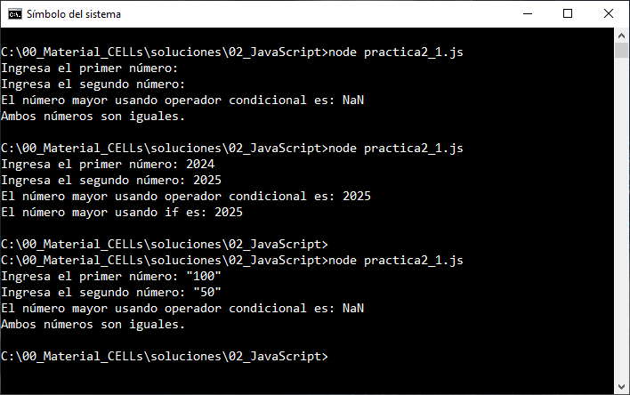
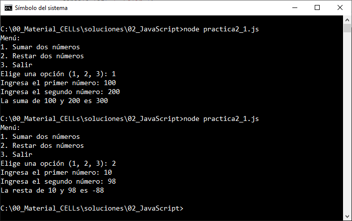
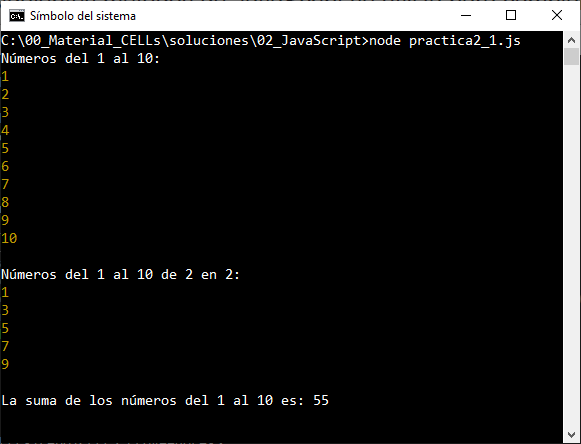
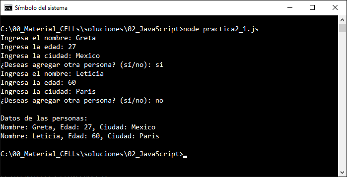

# Práctica 2.1. Fundamentos de JavaScript

## Objetivo:
Al finalizar la práctica, serás capaz de:
- Declarar variables utilizando `var`, `let` y `const`.
- Identificar y manejar tipos de datos primitivos y estructuras complejas.
- Emplear operadores y estructuras de control, como: `if`, `switch`, `for` y `while` para resolver problemas básicos.

## Duración aproximada:
- 35 minutos.

## Instrucciones:

### Tarea 1. Declaración de variables.

**Paso 1:**  
1. Abre tu editor de código y crea un archivo llamado `fundamentos.js`.
2. Declara tres variables: una con `var`, otra con `let` y la última con `const`.
3. Asigna un valor diferente a cada variable e imprime su contenido en la consola usando `console.log`.
4. Utiliza `Template Literal`.

**Paso 2:**  
1. Intenta reasignar valores a las variables declaradas con `var`, `let` y `const`.
2. Observa qué sucede y anota tus conclusiones como comentarios en el código.

**Paso 3:**
1. Prueba tu código ejecutando el archivo `fundamentos.js` con Node.js desde la terminal

`cmd
node fundamentos.js
`

### Tarea 2. Tipos de datos primitivos y estructuras complejas.

**Paso 1:**  

1. Declara variables de diferentes tipos de datos primitivos:  

  ```javascript
  let nombre = "Juan"; // String
  let edad = 30; // Número
  let esEstudiante = true; // Booleano
  let indefinido; // Undefined
  let nulo = null; // Null
  ```

2. Usa `console.log` y `typeof` para imprimir el valor y el tipo de cada variable.

**Paso 2:**  

1. Declara y trabaja con estructuras complejas:
  - Crea un **arreglo** con al menos 5 elementos. 
  - Accede a un elemento específico y modifica otro.
  - Declara un **objeto** con al menos 3 propiedades. 
  - Accede a una propiedad específica y agrega una nueva propiedad.

Ejemplo: 

```javascript

let arreglo = [1, 2, 3, 4, 5];
console.log(arreglo[2]); // Acceso
arreglo[0] = 10; // Modificación

let persona = { nombre: "Greta", edad: 25, ciudad: "Madrid" };
console.log(persona.nombre); // Acceso
console.log (persona["nombre"]);

persona.pais = "España"; // Nueva propiedad
persona["edad"] = 21;

```

### Tarea 3. Operadores y estructuras de control.

#### **Paso 1:**

1. Instala la librería `promp-sync`.

```cmd
npm install prompt-sync
```

**Nota:**
1. Útil para quienes están comenzando a aprender Node.js y necesitan simular interactividad.
2. No es ideal para aplicaciones complejas o que necesiten manejar entradas de manera no bloqueante (asincrónica).

**Paso 2:**  

1. Escribe un programa que solicite al usuario dos números y muestre el mayor utilizando un **operador condicional** y una estructura `if`.

```javascript

// Solicitar al usuario dos números
const prompt = require("prompt-sync")(); // Necesitas instalar esta librería: npm install prompt-sync

const numero1 = parseFloat(prompt("Ingresa el primer número: "));
const numero2 = parseFloat(prompt("Ingresa el segundo número: "));

// Solución usando operador condicional
const mayor = numero1 > numero2 ? numero1 : numero2;
console.log(`El número mayor usando operador condicional es: ${mayor}`);

// Solución usando estructura if
if (numero1 > numero2) {
  console.log(`El número mayor usando if es: ${numero1}`);
} else if (numero1 < numero2) {
  console.log(`El número mayor usando if es: ${numero2}`);
} else {
  console.log("Ambos números son iguales.");
}
```

**Paso 3:**  
1. Crea un programa con un menú usando un **switch** para las siguientes opciones:  
  - Sumar dos números.  
  - Restar dos números.  
  - Salir.  
  Permite al usuario elegir una opción y ejecuta la operación correspondiente.

```javascript
// Importar prompt-sync
const prompt = require("prompt-sync")();

// Mostrar el menú
console.log("Menú:");
console.log("1. Sumar dos números");
console.log("2. Restar dos números");
console.log("3. Salir");

// Solicitar al usuario que elija una opción
const opcion = prompt("Elige una opción (1, 2, 3): ");

switch (opcion) {
  case "1": {
    // Sumar dos números
    const numero1 = parseFloat(prompt("Ingresa el primer número: "));
    const numero2 = parseFloat(prompt("Ingresa el segundo número: "));
    console.log(`La suma de ${numero1} y ${numero2} es ${numero1 + numero2}`);
    break;
  }
  case "2": {
    // Restar dos números
    const numero1 = parseFloat(prompt("Ingresa el primer número: "));
    const numero2 = parseFloat(prompt("Ingresa el segundo número: "));
    console.log(`La resta de ${numero1} y ${numero2} es ${numero1 - numero2}`);
    break;
  }
  case "3":
    // Salir
    console.log("Saliendo del programa...");
    break;
  default:
    console.log("Opción no válida. Inténtalo de nuevo.");
}


```

**Paso 4:**  
1. Escribe un programa que use un **ciclo for** para imprimir los números del 1 al 10.
2. Escribe un programa que usa un **ciclo for** para imprimir los números del 1 al 10 de 2 en 2.
3. Escribe otro programa que use un **ciclo while** para sumar todos los números del 1 al 10 e imprima el resultado.

```javascript

// Programa 1: Imprimir los números del 1 al 10 usando un ciclo for
console.log("Números del 1 al 10:");
for (let i = 1; i <= 10; i++) {
  console.log(i);
}

// Programa 2: Imprimir los números del 1 al 10 de 2 en 2 usando un ciclo for
console.log("\nNúmeros del 1 al 10 de 2 en 2:");
for (let i = 1; i <= 10; i += 2) {
  console.log(i);
}

// Programa 3: Sumar los números del 1 al 10 usando un ciclo while
let suma = 0;
let numero = 1;

while (numero <= 10) {
  suma += numero; // Sumar el número actual
  numero++; // Incrementar el número
}

console.log(`\nLa suma de los números del 1 al 10 es: ${suma}`);


```

**Tarea 4. Integración.**

1. Combina los conceptos aprendidos:  

- Crea un programa que solicite al usuario un nombre, edad y ciudad.  

- Guarda los datos en un objeto y luego almacénalos en un arreglo de personas.  

- Usa un bucle para imprimir todos los datos de las personas en la consola.  

## Resultado esperado:
 
- Captura de pantalla con la salida de la Tarea 1.
 


- Captura de pantalla con la salida de la Tarea 2.
 


- Captura de pantalla con la salida de la Tarea 3.
 


- Captura de pantalla con la salida de la Tarea 4.
 

