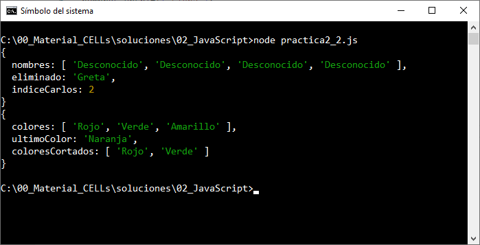
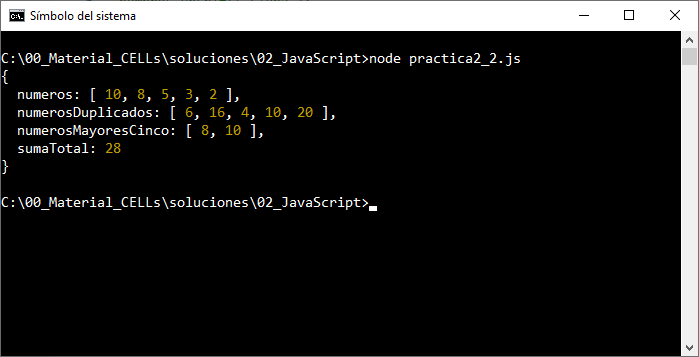
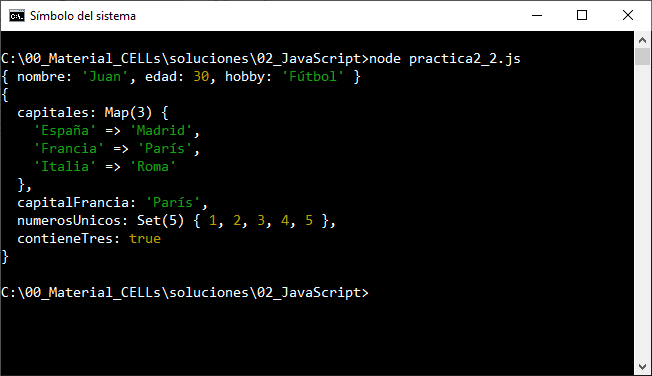
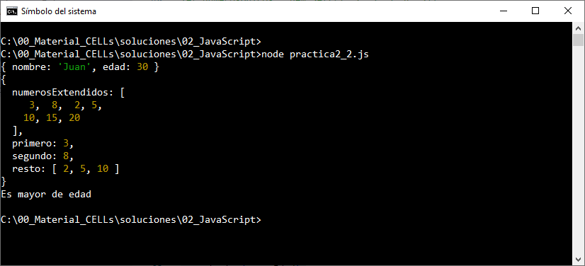

# Práctica 2.2. Manejo avanzado de datos en JavaScript

## Objetivo:
Al finalizar la práctica, serás capaz de:
- Aplicar métodos avanzados de manipulación de datos y operadores en JavaScript, incluyendo el uso de estructuras como Object, Map, Set y operadores avanzados como destructuración, spread/rest y ternarios para escribir código eficiente y expresivo.

## Duración aproximada:
- 35 minutos.

## Instrucciones:

### Tarea 1. Métodos de Arrays.

**Paso 1: Usar `shift`, `unshift`, `indexOf` y `fill`**.

1. Crea un array llamado `nombres` con los valores `["Greta", "Luis", "Carlos", "Everardo"]`.
2. Elimina el primer elemento del array utilizando `shift` y guarda el resultado en una variable.
3. Agrega el nombre `"Eduardo"` al inicio del array usando `unshift`.
4. Encuentra el índice del nombre `"Carlos"` usando `indexOf`.
5. Rellena todos los elementos del array con `"Desconocido"` usando `fill`.

```javascript
let nombres = ["Greta", "Luis", "Carlos", "Everardo"];
let eliminado = nombres.shift();
nombres.unshift("Elena");
let indiceCarlos = nombres.indexOf("Carlos");
nombres.fill("Desconocido");
console.log({ nombres, eliminado, indiceCarlos });
```

**Paso 2: Usar `push`, `pop`, `slice` y `splice`**
1. Crea un array llamado `colores` con los valores `["Rojo", "Verde", "Azul", "Amarillo"]`.
2. Agrega el color `"Naranja"` al final del array utilizando `push`.
3. Elimina el último color del array con `pop` y guárdalo en una variable.
4. Crea un nuevo array llamado `coloresCortados` que contenga solo los primeros dos colores utilizando `slice`.
5. Remueve el tercer elemento del array original usando `splice`.

```javascript
let colores = ["Rojo", "Verde", "Azul", "Amarillo"];
colores.push("Naranja");
let ultimoColor = colores.pop();
let coloresCortados = colores.slice(0, 2);
colores.splice(2, 1);
console.log({ colores, ultimoColor, coloresCortados });
```

### **Tarea 2: Métodos Funcionales de Arrays**.

**Paso 1: Usar `map`, `filter`, `reduce` y `sort`.**

1. Crea un array llamado `numeros` con los valores `[3, 8, 2, 5, 10]`.
2. Usa `map` para crear un nuevo array donde cada número esté multiplicado por 2.
3. Filtra los números mayores a 5 utilizando `filter`.
4. Usa `reduce` para obtener la suma de todos los números.
5. Ordena el array original de forma descendente utilizando `sort`.

```javascript
let numeros = [3, 8, 2, 5, 10];
let numerosDuplicados = numeros.map(num => num * 2);
let numerosMayoresCinco = numeros.filter(num => num > 5);
let sumaTotal = numeros.reduce((acc, num) => acc + num, 0);
numeros.sort((a, b) => b - a);
console.log({ numeros, numerosDuplicados, numerosMayoresCinco, sumaTotal });
```

### **Tarea 3: Estructuras avanzadas: `Object`, `Map` y `Set`**

**Paso 1: Uso de `Object`**.
1. Crea un objeto llamado `persona` con las propiedades `nombre`, `edad`, y `profesion`.
2. Agrega una nueva propiedad llamada `hobby`.
3. Elimina la propiedad `profesion`.

```javascript
let persona = { nombre: "Juan", edad: 30, profesion: "Ingeniero" };
persona.hobby = "Fútbol";
delete persona.profesion;
console.log(persona);
```

**Paso 2: Uso de `Map` y `Set`**
1. Crea un `Map` llamado `capitales` con los pares: `("España", "Madrid")`, `("Francia", "París")`.
2. Agrega un nuevo par al mapa: `("Italia", "Roma")`.
3. Obtén el valor de la clave `"Francia"`.
4. Crea un `Set` llamado `numerosUnicos` y agrega los valores `[1, 2, 3, 3, 4, 5]`.
5. Verifica si el valor `3` está en el conjunto.

```javascript
let capitales = new Map([["España", "Madrid"], ["Francia", "París"]]);
capitales.set("Italia", "Roma");
let capitalFrancia = capitales.get("Francia");

let numerosUnicos = new Set([1, 2, 3, 3, 4, 5]);
let contieneTres = numerosUnicos.has(3);
console.log({ capitales, capitalFrancia, numerosUnicos, contieneTres });
```

#### **Tarea 4: Operadores avanzados**.

**Paso 1: Destructuración**.
1. Desestructura el objeto `persona` para obtener las propiedades `nombre` y `edad`.

```javascript
let persona = { nombre: "Juan", edad: 30, profesion: "Ingeniero" };
let { nombre, edad } = persona;
console.log({ nombre, edad });
```

**Paso 2: Spread y Rest**.
1. Usa el operador spread para copiar el array `numeros` y agregar los valores `[15, 20]`.
2. Usa el operador rest para obtener los primeros dos valores de `numeros` en variables separadas y el resto en un nuevo array.

```javascript
let numeros = [3, 8, 2, 5, 10];
let numerosExtendidos = [...numeros, 15, 20];
let [primero, segundo, ...resto] = numeros;
console.log({ numerosExtendidos, primero, segundo, resto });
```

**Paso 3: Operador Ternario**.
1. Usa un operador ternario para verificar si la propiedad `edad` de `persona` es mayor o igual a 18 y asigna el resultado a una variable `mayorEdad`.

```javascript
let mayorEdad = edad >= 18 ? "Es mayor de edad" : "Es menor de edad";
console.log(mayorEdad);
```

## **Resultado esperado:**
 
Captura de pantalla que muestra la salida de la Tarea 1.



Captura de pantalla que muestra la salida de la Tarea 2.



Captura de pantalla que muestra la salida de la Tarea 3.



Captura de pantalla que muestra la salida de la Tarea 4.


