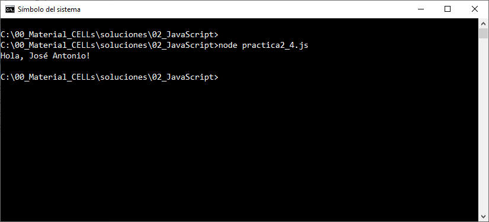
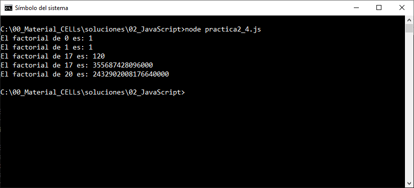
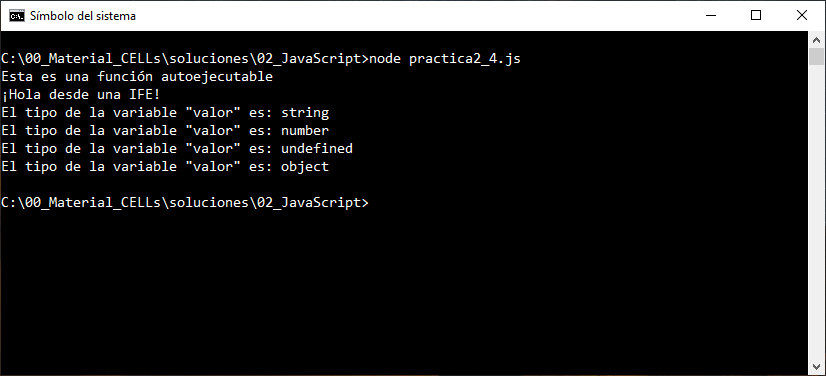
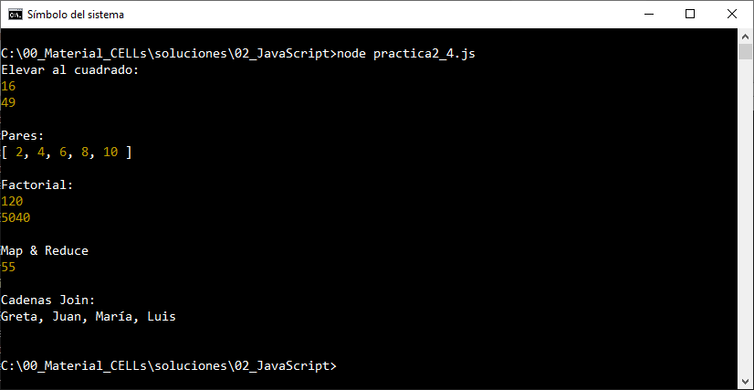
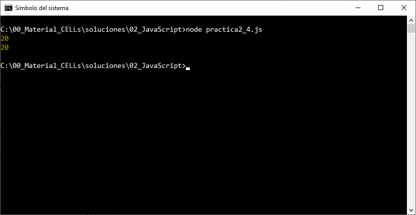
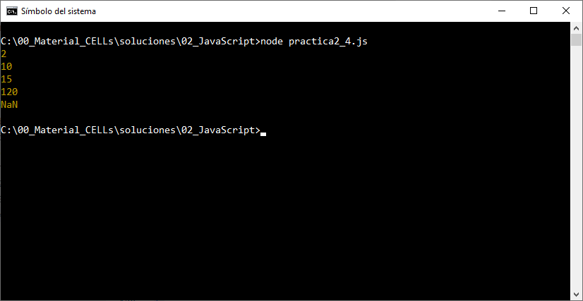

# Prática 2.4 Explorando las funciones en JavaScript

## Objetivo de la práctica:

Al finalizar esta práctica, serás capaz de implementar y aplicar diversos tipos de funciones en JavaScript, aprovechando conceptos clave como hoisting, recursividad, funciones autoejecutables (IFE), funciones flecha, anónimas y con parámetros predeterminados.


## Instrucciones Generales

1. Crea un archivo llamado `practica2_4.js` donde escribirás todo tu código.
2. Resuelve cada tarea en el orden establecido, comentando tu código para explicar lo que hace.
3. Prueba tus funciones y verifica que cumplen con lo solicitado.
4. Si es necesario, utiliza `console.log` para mostrar los resultados.


<br/><br/>

## Instrucciones

### Tarea 1. Declaración de Funciones y Hoisting
1. Declara una función llamada `saludar` que tome un parámetro `nombre` y devuelva el mensaje `Hola, {nombre}!`.

2. Invoca la función `saludar` antes de declararla y observa qué ocurre. 

3. Comenta tu observación en el código.
 
```javascript
console.log(saludar("José Antonio"));  

function saludar(nombre) {
    return `Hola, ${nombre}!`;
}
```

4. ¿Qué ocurre cuando invocamos una función declarada antes de su declaración en el código? 

5. ¿En qué parte del entorno de ejecución (memoria) se almacenan las declaraciones de funciones?

<br/><br/>


### Tarea 2. Recursividad

1. Crea una función llamada `factorial` que calcule el factorial de un número de forma recursiva.

2. Prueba tu función con los valores `0`, `1` y cualquier otro valor.

```javascript
function factorial(n) {
    if (n === 0) return 1;
    return n * factorial(n - 1);
}


console.log("El factorial de 0 es: " + factorial(0));  
console.log('El factorial de 1 es: ' + factorial(1));  
console.log(`El factorial de 17 es: ${factorial(5)}`);  
console.log(`El factorial de 17 es: ${factorial(17)}`);  
console.log("El factorial de 20 es: " + factorial(20));  

```

3. ¿Cuál es la máxima profundidad de llamadas que puede alcanzar esta función recursiva antes de causar un error?

4. ¿Entendiste las diferentes formas de usar comillas dobles, comillas simples y acentos invertidos en los Strings de JavaScript?

5. ¿Qué estrategias podrías utilizar para determinar el nivel máximo de recursividad que una función puede alcanzar antes de causar un error de desbordamiento de pila (stack overflow) en un entorno específico?

<br/><br/>

### Tarea 3. Funciones Autoejecutables (IFE)

1. Crea una función autoejecutable que imprima en consola el mensaje "Esta es una función autoejecutable".

2. Haz que la función reciba un parámetro y lo imprima.

```javascript
(function () {
    console.log("Esta es una función autoejecutable");
})();

(function (mensaje) {
    console.log(mensaje);
})("¡Hola desde una IFE!");

(function (valor) {
     console.log(`El tipo de la variable "valor" es: ${typeof valor}`); 
})("5");


(function (valor) {
     console.log(`El tipo de la variable "valor" es: ${typeof valor}`); 
})(5);

(function (valor) {
     console.log(`El tipo de la variable "valor" es: ${typeof valor}`); 
})();

(function (valor) {
     console.log(`El tipo de la variable "valor" es: ${typeof valor}`); 
})(null);
```

3. ¿Qué diferencia a una función IFE de una función declarada tradicionalmente en términos de cómo y cuándo se ejecuta?

4. ¿Qué ventajas tiene utilizar una función IFE en lugar de declarar una función normal cuando se necesita ejecutar código inmediatamente?

5. ¿Qué sucede si intentas pasar parámetros a una función IFE?


<br/><br/>

### Tarea 4. Funciones Flecha

#### **Paso 1: Elevar un número al cuadrado**

1. Crea una función flecha llamada `elevarAlCuadrado` que reciba un número y devuelva su cuadrado.

2. Utiliza esta función para elevar los números `4` y `7` al cuadrado.

```javascript
const elevarAlCuadrado = (num) => num * num;

console.log("Elevar al cuadrado:")
console.log(elevarAlCuadrado(4));
console.log(elevarAlCuadrado(7));
console.log();
```

#### **Paso 2: Filtrar números pares de un arreglo**
1. Declara un arreglo llamado `numeros` con los valores `[1, 2, 3, 4, 5, 6, 7, 8, 9, 10]`.

2. Usa una función flecha con el método `filter` para obtener solo los números pares.

```javascript
const numeros = [1, 2, 3, 4, 5, 6, 7, 8, 9, 10];
const pares = numeros.filter((num) => num % 2 === 0);

console.log("Pares:")
console.log(pares);
console.log();
```

#### **Paso 3: Calcular el factorial de un número**
1. Crea una función flecha llamada `factorial` que calcule el factorial de un número de manera recursiva.

```javascript
const fac = (n) => (n <= 1 ? 1 : n * fac(n - 1));

console.log("Factorial: ")
console.log(fac(5));
console.log(fac(7));
console.log();

```

#### **Paso 4: Calcular la suma de los cuadrados de un arreglo**
1. Usa las funciones flecha con los métodos `map` y `reduce` para calcular la suma de los cuadrados de los números en un arreglo.

```javascript

const numeros2 = [1, 2, 3, 4, 5];
const sumaCuadrados = numeros2
    .map((num) => num * num)  
    .reduce((acumulador, valor) => acumulador + valor, 0);  

console.log("Map & Reduce")
console.log(sumaCuadrados);
console.log();
```

#### **Paso 5: Combinar cadenas**

1. Crea una función flecha llamada `concatenarCadenas` que reciba un arreglo de cadenas y las combine en una sola, separadas por comas.

```javascript
console.log("Cadenas Join:")
const concatenarCadenas = (cadenas) => cadenas.join(", ");

const nombres = ["Greta", "Juan", "María", "Luis"];
console.log(concatenarCadenas(nombres));
console.log();
```


<br/><br/>

### Tarea 5: Funciones Anónimas

1. Declara una función anónima que sume dos números y asígnala a una variable llamada `sumar`.

2. Invoca la función con los valores `8` y `12`.

```javascript
const sumar = function (a, b) {
    return a + b;
};

console.log(sumar(8, 12)); 

ff=sumar;
console.log(ff(8,12)); 
```

<br/><br/>

### Tarea 6. Funciones con Parámetros Predeterminados

1. Crea una función llamada `multiplicar` que reciba dos parámetros:
   - `a` (número opcional con valor predeterminado de `1`).
   - `b` (número opcional con valor predeterminado de `2`).

2. Modifica la función para que acepte un número variable de argumentos adicionales utilizando el operador **rest** (`...otros`).

3. Dentro de la función:
   - Multiplica los valores de `a` y `b` como primer paso.
   - Usa un ciclo o método de arreglo (como `forEach`) para multiplicar el resultado por cada número capturado con el operador rest (`...otros`).

4. Invoca la función en los siguientes escenarios:
   - Sin argumentos.
   - Con un solo argumento (`a`).
   - Con dos argumentos (`a` y `b`).
   - Con más de dos argumentos (`a`, `b`, y números adicionales).
   - Con más de dos argumentos (`a`, `b`, y un arreglo de enteros).

5. Imprime los resultados de cada invocación en consola y observa el comportamiento de la función con diferentes cantidades de argumentos.

6. En caso de error, realiza los cambios que consideres necesarios

```javascript
function multiplicar(a=1, b = 2, ...otros) {
   
    let resultado = a * b;
    
    otros.forEach((num) => {
        resultado *= num;
    });
    
    return resultado;
}

console.log(multiplicar());
console.log(multiplicar(5));              
console.log(multiplicar(5, 3));        

console.log(multiplicar(5, 3, 2, 4)); 

const valores= [ 2,4,6,8];
console.log(multiplicar(5, 3, 2, valores));       

```

<br/><br/>


### Resultado esperado

- Captura de pantalla mostrando la salida obtenida en la Tarea 1.



<br/>

- Captura de pantalla mostrando la salida obtenida en la Tarea 2.



<br/>

- Captura de pantalla mostrando la salida obtenida en la Tarea 3.



<br/>

- Captura de pantalla mostrando la salida obtenida en la Tarea 4.



<br/>

- Captura de pantalla mostrando la salida obtenida en la Tarea 5.



<br/>

- Captura de pantalla mostrando la salida obtenida en la Tarea 6.



<br/>
