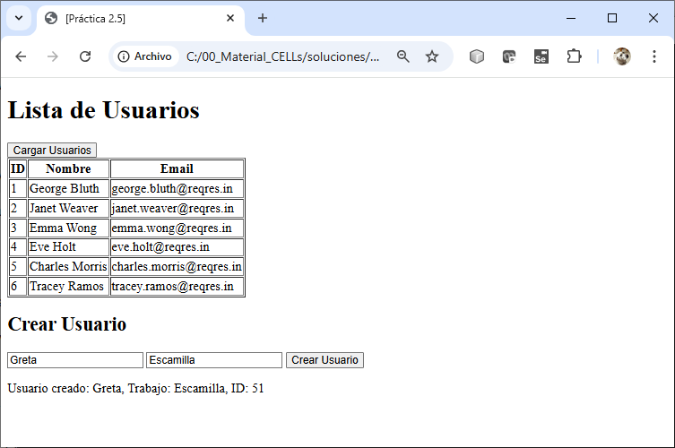

# Práctica 2.4.2  Manejo Asíncrono de Datos con Async/Await y Fetch

## Objetivo:
Al finalizar esta práctica, serás capaz de:
1. Utilizar `fetch` para realizar llamadas HTTP y obtener datos de una API.
2. Manejar datos asíncronos utilizando promesas.
3. Implementar `async` y `await` para simplificar el manejo de operaciones asíncronas.
4. Manejar errores en llamadas asíncronas y mostrar mensajes adecuados al usuario.
5. Manipular datos obtenidos de una API para mostrarlos de manera organizada en una página web.
 

## Duración aproximada:
- 35 minutos.
 
## Instrucciones Generales

1. **Archivos iniciales**: Crea un archivo `practica2_5.html` y un archivo `practica2_5.js` donde escribirás el código JavaScript.

2. Utiliza la API [https://reqres.in/](https://reqres.in/) para obtener datos de usuarios y probar la creación de un nuevo usuario.


## Instrucciones

### **Tarea 1: Obtener y Mostrar Usuarios**

#### Paso 1. **En `practica2_4_2.html`, agrega una estructura básica con un botón y una tabla para mostrar usuarios:**

      ```html
      <!DOCTYPE html>
      <html lang="en">
      <head>
          <meta charset="UTF-8">
          <meta name="viewport" content="width=device-width, initial-scale=1.0">
          <title>[Práctica 2.4-2]</title>
      </head>
      <body>
          <h1>Lista de Usuarios</h1>
          <button id="loadUsers">Cargar Usuarios</button>
          <table border="1">
              <thead>
                  <tr>
                      <th>ID</th>
                      <th>Nombre</th>
                      <th>Email</th>
                  </tr>
              </thead>
              <tbody id="userTable"></tbody>
          </table>
          <script src="app.js"></script>
      </body>
      </html>
      ```

#### Paso 2. **En `app.js`, escribe la función para obtener los datos de usuarios:**

      ```javascript
      async function fetchUsers() {
          try {
              const response = await fetch('https://reqres.in/api/users?page=1');
              if (!response.ok) throw new Error('Error al obtener usuarios');
              const data = await response.json();

              const userTable = document.getElementById('userTable');
              userTable.innerHTML = '';  
              data.data.forEach(user => {
                  const row = `<tr>
                      <td>${user.id}</td>
                      <td>${user.first_name} ${user.last_name}</td>
                      <td>${user.email}</td>
                  </tr>`;
                  userTable.innerHTML += row;
              });
          } catch (error) {
              alert(error.message);
          }
      }

      document.getElementById('loadUsers').addEventListener('click', fetchUsers);
      ```
 

### **Tarea 2: Crear un Usuario**

#### Paso 1. ** En `index.html`, agrega un formulario para ingresar los datos del nuevo usuario:**

      ```html
      <h2>Crear Usuario</h2>
      <form id="createUserForm">
          <input type="text" id="userName" placeholder="Nombre" required>
          <input type="text" id="userJob" placeholder="Trabajo" required>
          <button type="submit">Crear Usuario</button>
      </form>
      <div id="createdUser"></div>
      ```

#### Paso 2. **En `app.js`, escribe la lógica para crear un usuario:**

      ```javascript
      async function createUser(event) {
          event.preventDefault();  
          
          const name = document.getElementById('userName').value;
          const job = document.getElementById('userJob').value;

          try {
              const response = await fetch('https://reqres.in/api/users', {
                  method: 'POST',
                  headers: {
                      'Content-Type': 'application/json',
                  },
                  body: JSON.stringify({ name, job }),
              });

              if (!response.ok) throw new Error('Error al crear usuario');
              const data = await response.json();

              const createdUser = document.getElementById('createdUser');
              createdUser.innerHTML = `
                  <p>
                  Usuario creado: ${data.name}, Trabajo: ${data.job}, ID: ${data.id}
                  </p>
              `;
          } catch (error) {
              alert(error.message);
          }
      }

      document.getElementById('createUserForm').addEventListener('submit', createUser);
      ```

### **Tarea 3: Manejo de Errores (Opcional)**

1. **Objetivo**: Implementar manejo de errores en las llamadas a la API.

2. **Pasos**:
   - En las funciones `fetchUsers` y `createUser`, ya se manejan errores con `try...catch`.

   - Simula un error modificando la URL en el método `fetch` (por ejemplo, usa una URL incorrecta como `'https://reqres.in/api/invalid'`) y observa cómo se muestra el mensaje de error.
   
   
<br/><br/>

### Resultado esperado



