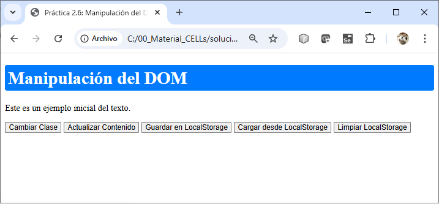

# Prática 2.5. DOM

## Objetivo:
Al finalizar la práctica, serás capaz de:
- Manipular elementos del DOM seleccionándolos y modificando su contenido y estilos.
- Gestionar clases de elementos del DOM utilizando la API classList.
- Implementar y manejar eventos en el DOM utilizando funciones flecha.
- Utilizar atributos data-* y la propiedad dataset para gestionar información dinámica.
- Aplicar LocalStorage y SessionStorage para almacenar datos persistentes y temporales.

## Duración aproximada:
- 40 minutos.

## Instrucciones:

### **Tarea 1: Crear el HTML base.**

1. Crea un archivo `practica2_5.html` con la siguiente estructura:

```html
<!DOCTYPE html>
<html lang="en">
<head>
  <meta charset="UTF-8">
  <meta name="viewport" content="width=device-width, initial-scale=1.0">
  <title>Práctica 2.6: Manipulación del DOM</title>
  <style>
    .highlight {
      color: white;
      background-color: #007bff;
      padding: 5px;
      border-radius: 4px;
    }
  </style>
</head>
<body>
  <h1 id="title">Manipulación del DOM</h1>
  <p id="description" data-info="editable">Este es un ejemplo inicial del texto.</p>
  <button id="toggleClass">Cambiar Clase</button>
  <button id="updateContent">Actualizar Contenido</button>
  <button id="saveToLocalStorage">Guardar en LocalStorage</button>
  <button id="loadFromLocalStorage">Cargar desde LocalStorage</button>
  <button id="clearLocalStorage">Limpiar LocalStorage</button>
  <div id="message"></div>

  <script src="practica2_5.js"></script>
</body>
</html>
```

### **Tarea 2: Seleccionar elementos y manipular contenido.**

1. Crea un archivo `practica2_5.js` y selecciona los elementos en el DOM utilizando `querySelector`.
2. Cambia el contenido del párrafo con un evento.

```javascript
document.querySelector("#updateContent").addEventListener("click", () => {
  const description = document.querySelector("#description");
  description.textContent = "El contenido ha sido actualizado dinámicamente.";
});
```

### **Tarea 3: Modificar estilos utilizando `classList`.**

1. Añade o elimina una clase utilizando `classList.toggle`.

```javascript
document.querySelector("#toggleClass").addEventListener("click", () => {
  const title = document.querySelector("#title");
  title.classList.toggle("highlight");
});
```

### **Tarea 4: Utilizar `data-*` y `dataset`.**

1. Muestra el valor del atributo `data-info` del párrafo y actualízalo dinámicamente.

```javascript
document.querySelector("#updateContent").addEventListener("click", () => {
  const description = document.querySelector("#description");
  console.log("Información actual:", description.dataset.info);
  description.dataset.info = "actualizado";
});
```

### **Tarea 5: Almacenamiento con LocalStorage y SessionStorage.**

1. Guarda y recupera el contenido del párrafo utilizando LocalStorage.

```javascript
document.querySelector("#saveToLocalStorage").addEventListener("click", () => {
  const description = document.querySelector("#description").textContent;
  localStorage.setItem("description", description);
  document.querySelector("#message").textContent = "Contenido guardado en LocalStorage.";
});

document.querySelector("#loadFromLocalStorage").addEventListener("click", () => {
  const savedDescription = localStorage.getItem("description");
  if (savedDescription) {
    document.querySelector("#description").textContent = savedDescription;
    document.querySelector("#message").textContent = "Contenido cargado desde LocalStorage.";
  } else {
    document.querySelector("#message").textContent = "No hay contenido guardado en LocalStorage.";
  }
});

document.querySelector("#clearLocalStorage").addEventListener("click", () => {
  localStorage.removeItem("description");
  document.querySelector("#message").textContent = "LocalStorage limpiado.";
});
```

#### **Tareas adicionales:**

1. **Añadir estilos condicionales:** Cambia el color del texto del párrafo basándote en el valor almacenado en `data-info`.

2. **Extender almacenamiento:** Usa `sessionStorage` para guardar temporalmente el estado de un botón (si está activado o no).

```javascript
// Guardar el estado del botón en sessionStorage
document.querySelector("#toggleClass").addEventListener("click", () => {
    const title = document.querySelector("#title");
    const isHighlighted = title.classList.contains("highlight");

    // Guardar el estado (true o false) en sessionStorage
    sessionStorage.setItem("isHighlighted", isHighlighted);
});

// Restaurar el estado del botón al cargar la página
window.addEventListener("load", () => {
    const isHighlighted = sessionStorage.getItem("isHighlighted") === "true";

    if (isHighlighted) {
        document.querySelector("#title").classList.add("highlight");
    }
});


// Guardar el estado del botón en sessionStorage
document.querySelector("#toggleClass").addEventListener("click", () => {
    const title = document.querySelector("#title");
    const isHighlighted = title.classList.contains("highlight");

    // Guardar el estado (true o false) en sessionStorage
    sessionStorage.setItem("isHighlighted", isHighlighted);
});

// Restaurar el estado del botón al cargar la página
window.addEventListener("load", () => {
    const isHighlighted = sessionStorage.getItem("isHighlighted") === "true";

    if (isHighlighted) {
        document.querySelector("#title").classList.add("highlight");
    }
});

```

### **Resultado esperado:**

1. El usuario puede interactuar con los botones para manipular el contenido y estilo de los elementos del DOM.

2. Los cambios pueden ser guardados en LocalStorage y restaurados al presionar el botón correspondiente.

3. Los datos temporales persisten durante la sesión del navegador utilizando `sessionStorage`.


