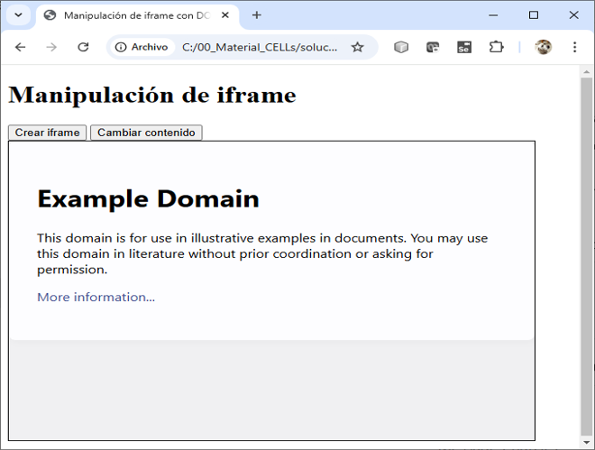
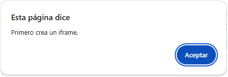
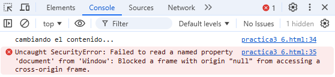

# Prática 2.6 DOM II

## Objetivo:
Al finalizar la práctica, serás capaz de manipular elementos del DOM seleccionándolos y modificando su contenido usando iframes.

## Duración aproximada:
- 15 minutos.

## Instrucciones 

### Tarea I. Crear y manipular un iframe dinámicamente


```html
<!DOCTYPE html>
<html lang="en">
<head>
  <meta charset="UTF-8">
  <meta name="viewport" content="width=device-width, initial-scale=1.0">
  <title>[DOM II - iframe]</title>
</head>
<body>
  <h1>Manipulación de iframe</h1>
  <button id="createIframe">Crear iframe</button>
  <button id="changeContent">Cambiar contenido</button>
  <div id="container"></div>

  <script>
    const createIframeButton = document.getElementById("createIframe");
    const changeContentButton = document.getElementById("changeContent");
    const container = document.getElementById("container");
    let iframe; // Variable para almacenar el iframe

    // Evento para crear un iframe
    createIframeButton.addEventListener("click", () => {
      // Crear el elemento iframe
      iframe = document.createElement("iframe");
      iframe.src = "https://example.com"; // Establecer la URL inicial
      iframe.width = "600";
      iframe.height = "400";
      iframe.style.border = "1px solid #000";
      container.appendChild(iframe); // Agregar el iframe al contenedor
    });

    // Evento para cambiar el contenido del iframe
    changeContentButton.addEventListener("click", () => {
      if (iframe) {
        const iframeDoc = iframe.contentDocument || iframe.contentWindow.document;
        // Cambiar el contenido del iframe
        iframeDoc.body.innerHTML = `
          <h2>Contenido modificado dinámicamente</h2>
          <p>Este contenido fue agregado desde el documento principal mediante JavaScript.</p>
        `;
      } else {
        alert("Primero crea un iframe.");
      }
    });
  </script>
</body>
</html>
```

#### Notas:

1. **Botón "Crear iframe":**
   - Se crea un iframe con el método `document.createElement("iframe")`.
   - Se establece la URL con el atributo `src`.
   - Se configura el ancho, alto y borde del iframe.
   - Finalmente, se agrega al contenedor con `appendChild`.

2. **Botón "Cambiar contenido":**
   - Se obtiene el documento interno del iframe usando `iframe.contentDocument` o `iframe.contentWindow.document` (dependiendo del navegador).
   - Se modifica el contenido del iframe utilizando `innerHTML`.


<br/>
<br/>


## Resultado Esperado

- Captura de pantalla con el diseño de la página con IFrame.



<br/>

- Realiza una captura de pantalla que muestre el mensaje de alerta generado al intentar cambiar el contenido del iframe antes de haberlo creado. Este mensaje aparece cuando el botón "Cambiar Contenido" se pulsa sin que el iframe exista en el documento. 



<br/>

- Captura de pantalla que muestra el error generado en la consola del navegador al intentar acceder al contenido del iframe cuando este carga un recurso externo que no cumple con las políticas de mismo origen (CORS). Este error ocurre debido a las restricciones de seguridad impuestas por el navegador para proteger los datos.


