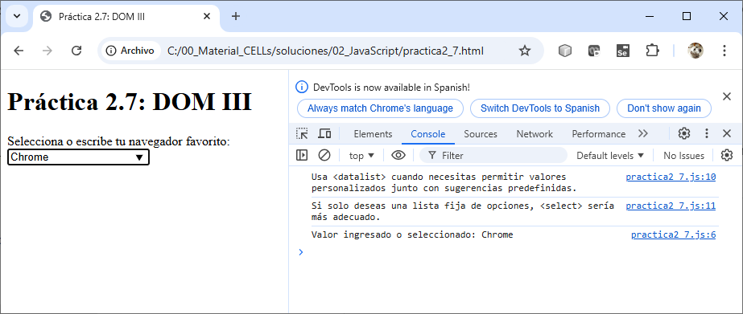

# Prática 2.7 DOM III

## Objetivo:

Al finalizar esta práctica, serás capaz de asociar y manipular dinámicamente elementos `<datalist>` y `<input>` en el DOM, así como comprender cuándo usar `<datalist>` en lugar de `<select>`


## Duración aproximada:
- 15 minutos.

## Instrucciones 

### **Tareas:**
1. Crear un formulario que incluya un campo `<input>` asociado a un elemento `<datalist>`.
2. Proveer una lista de opciones predefinidas en el `<datalist>`.
3. Escribir código en JavaScript para:
   - Verificar y mostrar un mensaje en la consola cuando el usuario selecciona o escribe un valor en el `<input>`.
   - Explicar mediante un mensaje en la consola por qué usar `<datalist>` en lugar de `<select>`.

#### Paso 1. **Configuración inicial:**
   - Crea un archivo `practica2_7.html` con la estructura básica.
   - Añade un formulario que incluya un campo `<input>` asociado a un elemento `<datalist>`.

#### Paso 2. **Estructura del HTML:**

- Copia el siguiente código en tu archivo:
  
   ```html
   <!DOCTYPE html>
   <html lang="en">
   <head>
       <meta charset="UTF-8">
       <meta name="viewport" content="width=device-width, initial-scale=1.0">
       <title>[DOM III - datalist]</title>
   </head>
   <body>
       <h1>Práctica 2.7: DOM III</h1>
       <form>
           <label for="browser">Selecciona o escribe tu navegador favorito:</label>
           <input id="browser" list="browsers" placeholder="Escribe aquí...">
           <datalist id="browsers">
               <option value="Chrome">
               <option value="Firefox">
               <option value="Edge">
               <option value="Safari">
           </datalist>
       </form>
       <script src="practica2_7.js"></script>
   </body>
   </html>
   ```

#### Paso 3. **Agregar funcionalidad con JavaScript:**
   - Crea un archivo `practica2_7.js.js` en el mismo directorio.
   - Escribe el siguiente código en `script.js` para asociar eventos al `<input>`:

   ```javascript
   document.addEventListener('DOMContentLoaded', () => {
       const input = document.getElementById('browser');

       // Escucha cambios en el campo de entrada
       input.addEventListener('input', () => {
           console.log(`Valor ingresado o seleccionado: ${input.value}`);
       });

       // Explica cuándo usar datalist en lugar de select
       console.log('Usa <datalist> cuando necesitas permitir valores personalizados junto con sugerencias predefinidas.');
       console.log('Si solo deseas una lista fija de opciones, <select> sería más adecuado.');
   });
   ```

#### Paso 4. **Prueba tu solución:**
   - Abre el archivo `practica2_7.html` en un navegador.
   - Escribe un valor en el campo de entrada o selecciona una opción de las sugerencias predefinidas.
   - Observa cómo se registran mensajes en la consola.

#### Paso 5. **Desafío adicional (opcional):**
   - Añade un botón al formulario que, al ser presionado, muestre en la consola el valor actual del campo `<input>`.

<br/>
<br/>

## Resultado Esperado

- Captura de pantalla con la salida de esta práctica.

