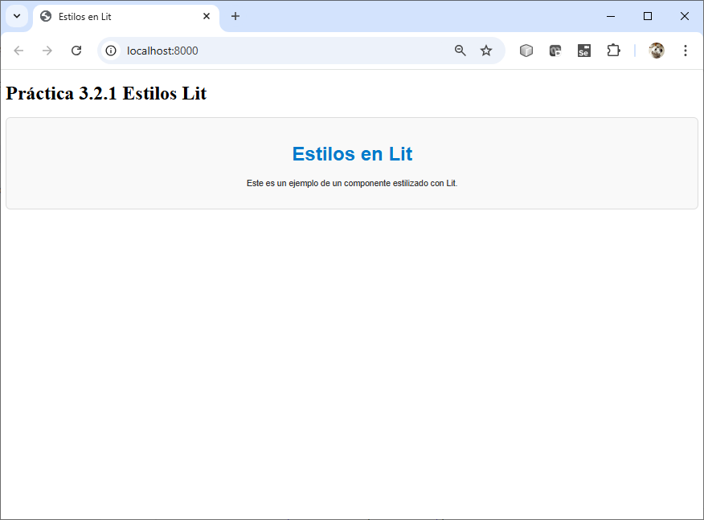
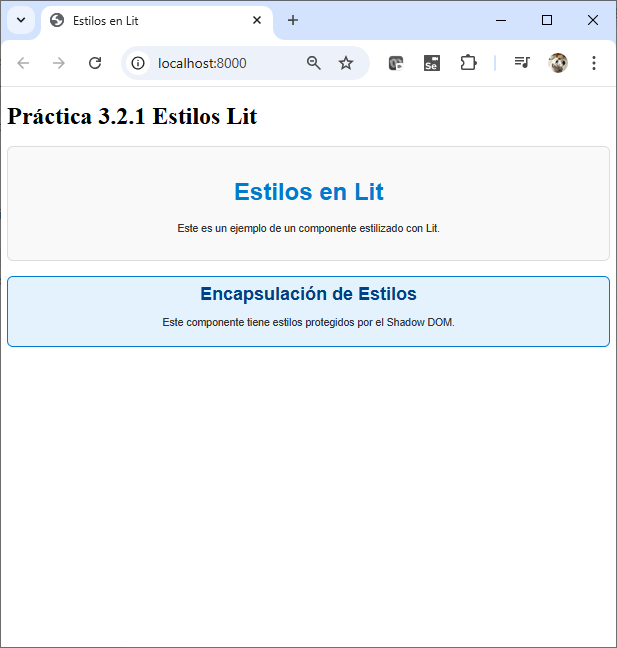
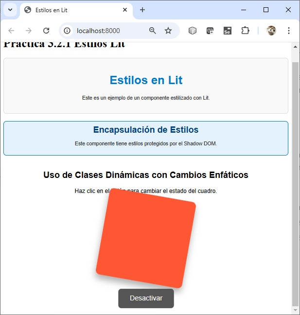
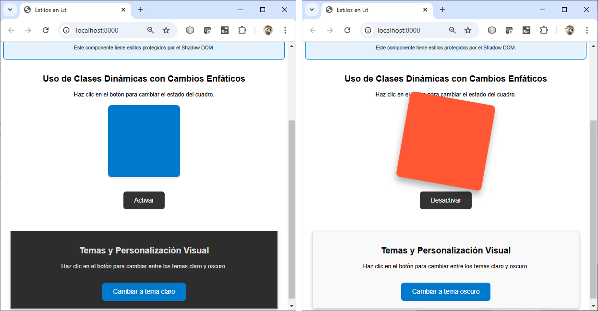
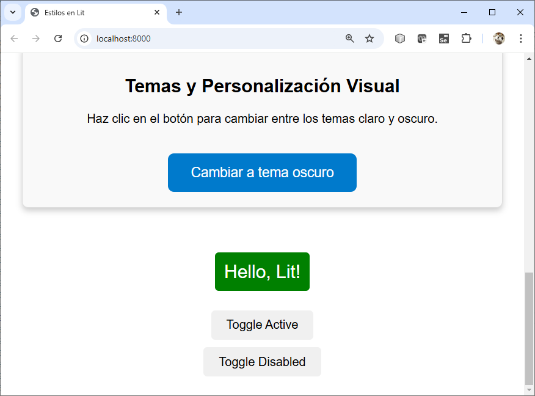
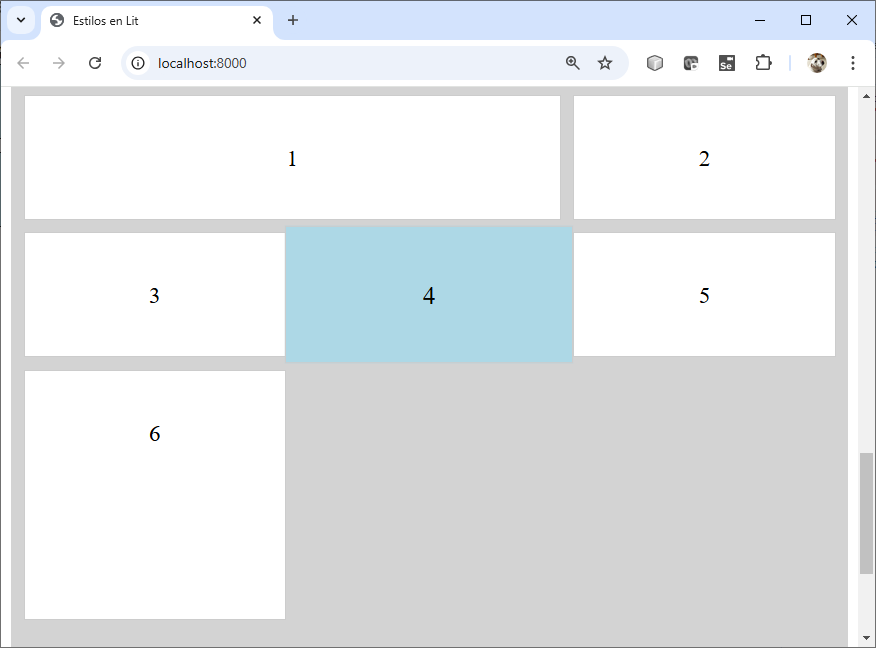

# Práctica 3.2.1. Estilos en Lit

## Objetivo:
Al finalizar la práctica, serás capaz de:
- Definir estilos CSS dentro de un componente Lit.
- Aplicar estilos CSS a componentes Lit utilizando clases dinámicas para modificar la apariencia de los elementos en tiempo de ejecución.
- Implementar estilos CSS en un componente Lit y utilizar clases dinámicas para modificar la apariencia de los elementos en respuesta a eventos o estados internos.
- Implementar un componente Lit con soporte para temas visuales y personalización mediante propiedades y variables CSS.
- Implementar un diseño con CSS Grid utilizando propiedades como `grid-template-columns`, `grid-template-rows`, `grid-column`
 
## Duración aproximada:
- 125 minutos.

## Instrucciones: 

### Tarea 1. Estilos en Lit.

**Paso 1. Crear la carpeta principal del proyecto.**
 1. Ejecuta el siguiente comando para crear una carpeta llamada `practica3_2_1` que contendrá tu proyecto.
  
   ```cmd
   mkdir practica3_2_1
   ```

**Paso 2. Inicializar el proyecto con Node.js.**
 1. Navega a la carpeta recién creada y prepara el entorno de trabajo inicializando un proyecto con Node.js.

   ```cmd
   cd practica3_2_1
   npm init -y
   npm install lit
   npm install --save-dev es-dev-server
   ```

**Paso 3. Crear la estructura de carpetas y archivos.**

1. Crea una subcarpeta llamada `src` para organizar los archivos fuente.  
    
     ```cmd
     mkdir src
     ```

2. Dentro de la carpeta raíz, crea un archivo llamado `index.html`, que será el punto de entrada de tu proyecto.  
    
     ```cmd
     touch index.html
     ```
   
3. Dentro de la carpeta `src`, crea un archivo llamado `bb-estilos.js`, donde escribirás los estilos de tu componente Lit.  
    
     ```cmd
     cd src
     touch bb-estilos.js
     ```  

- **Nota** Con estos pasos, tendrás listo el proyecto base para comenzar a trabajar con estilos en Lit.


**Paso 4. Agregar contenido al archivo `bb-estilos.js`.**  

1. Este archivo define un componente Lit con estilos aplicados.

   ```javascript
   import { LitElement, html, css } from 'lit';

   class BbEstilos extends LitElement {
     // Definición de estilos
     static styles = css`
       :host {
         display: block;
         font-family: Arial, sans-serif;
         text-align: center;
         color: #333;
       }
       .container {
         padding: 20px;
         border: 1px solid #ddd;
         border-radius: 8px;
         background-color: #f9f9f9;
       }
       h1 {
         color: #007acc;
       }
       p {
         font-size: 14px;
       }
     `;

     // Renderizado del componente
     render() {
       return html`
         <div class="container">
           <h1>Estilos en Lit</h1>
           <p>Este es un ejemplo de un componente estilizado con Lit.</p>
         </div>
       `;
     }
   }

   customElements.define('bb-estilos', BbEstilos);
   ```

**Paso 5. Actualizar el archivo `index.html`.**  

1. Este archivo carga el componente y muestra su contenido.

   ```html
   <!DOCTYPE html>
   <html lang="en">
   <head>
     <meta charset="UTF-8" />
     <meta name="viewport" content="width=device-width, initial-scale=1.0" />
     <title>Estilos en Lit</title>
   </head>
   <body>
     <h1>Bienvenido a la práctica de Lit</h1>
    
     <!-- Componente personalizado -->
     <bb-estilos></bb-estilos>

     <!-- Cargar el módulo de JavaScript -->
     <script type="module" src="./src/bb-estilos.js"></script>
   </body>
   </html>
   ```

**Paso 6. Iniciar un servidor local para visualizar el proyecto.**  

1. Agrega la instrucción siguiente en el archivo `package.json`

    ```json
    "scripts": {
        "start": "es-dev-server --app-index index.html --node-resolve --open"
      },
    
    ```

2. Inicia el servidor local para ejecutar el proyecto.

   ```cmd
   npm start
   ```

**Paso 7. Verificar el resultado.**  

1. Abre tu navegador web y observa cómo el componente `bb-estilos` se carga con los estilos definidos. Asegúrate de que los estilos se apliquen correctamente y que el diseño sea coherente.

### Tarea 2. Encapsulación de estilos con Shadow DOM.

En esta tarea, aprenderás a encapsular estilos utilizando el Shadow DOM con Lit, garantizando que los estilos definidos no afecten ni sean afectados por otros elementos externos.
 
**Paso 1. Definir el componente en `bb-encapsulacion.js`:**

 1. Este archivo define un componente Lit con estilos encapsulados en el Shadow DOM.

   ```javascript
   import { LitElement, html, css } from 'lit';

   class BbEncapsulacion extends LitElement {
     // Definición de estilos encapsulados
     static styles = css`
       :host {
         display: block;
         font-family: Arial, sans-serif;
         text-align: center;
         padding: 10px;
         border: 2px solid #007acc;
         border-radius: 8px;
         background-color: #e3f2fd;
       }
       h2 {
         color: #004085;
         margin: 0;
       }
       p {
         font-size: 14px;
         color: #333;
       }
     `;

     // Renderizado del componente
     render() {
       return html`
         <h2>Encapsulación de Estilos</h2>
         <p>Este componente tiene estilos protegidos por el Shadow DOM.</p>
       `;
     }
   }

   customElements.define('bb-encapsulacion', BbEncapsulacion);
   ```

**Paso 2. Actualizar el archivo `index.html`:**

1. Este archivo carga y muestra el componente con los estilos encapsulados.

   ```html
   <!DOCTYPE html>
   <html lang="en">
   <head>
     <meta charset="UTF-8" />
     <meta name="viewport" content="width=device-width, initial-scale=1.0" />
     <title>Encapsulación de Estilos con Shadow DOM</title>
   </head>
   <body>
     <h1>Demostración de Shadow DOM</h1>
     <!-- Componente personalizado -->
     <bb-encapsulacion></bb-encapsulacion>

     <!-- Cargar el módulo de JavaScript -->
     <script type="module" src="./src/bb-encapsulacion.js"></script>
   </body>
   </html>
   ```

**Paso 3. Probar el Componente**

1. Utiliza un servidor local  para visualizar la aplicación.

    ```cmd
    npm start
    ```
   
**Paso 4. Verifica el resultado:**   

1. Abre tu navegador web y carga el archivo `index.html`.
2. Observa cómo los estilos del componente `bb-encapsulacion` se aplican solo a su contenido y están protegidos por el Shadow DOM.


**Paso 5. Modificar los estilos CSS**

1. Busca la definición de estilos en el componente (la propiedad static styles).
2. Cambia las propiedades del borde para establecer un grosor de 2 píxeles, un estilo sólido y un color rojo.
 
### Tarea 3. Uso de CSS en componentes Lit (CSS y clases dinámicas)

En esta tarea, aprenderás a usar estilos en componentes Lit, incluyendo la manipulación de clases dinámicas para personalizar la apariencia de los elementos en tiempo de ejecución.

**Paso 1. Definir el componente en `bb-clases-dinamicas.js`.**

1. Este archivo define un componente Lit que utiliza clases dinámicas para aplicar estilos según el estado interno del componente.

```javascript
  import { LitElement, html, css } from 'lit';

class BbClasesDinamicas extends LitElement {
  // Definición de estilos
  static styles = css`
    :host {
      display: block;
      font-family: Arial, sans-serif;
      text-align: center;
      margin: 20px;
    }
    .box {
      width: 200px;
      height: 200px;
      margin: 20px auto;
      background-color: #007acc;
      border-radius: 10px;
      transition: transform 0.3s ease, background-color 0.3s ease, box-shadow 0.3s ease;
      box-shadow: 0px 4px 6px rgba(0, 0, 0, 0.1);
    }
    .active {
      background-color: #ff5733;
      transform: scale(1.2) rotate(10deg);
      box-shadow: 0px 10px 15px rgba(0, 0, 0, 0.3);
    }
    .button {
      padding: 15px 30px;
      font-size: 18px;
      color: white;
      background-color: #333;
      border: none;
      border-radius: 8px;
      cursor: pointer;
      margin-top: 20px;
      transition: background-color 0.3s ease, transform 0.2s ease;
    }
    .button:hover {
      background-color: #555;
      transform: scale(1.05);
    }
  `;

  // Propiedades del componente
  static properties = {
    isActive: { type: Boolean },
  };

  constructor() {
    super();
    this.isActive = false; // Estado inicial
  }

  // Alternar el estado activo
  toggleActive() {
    this.isActive = !this.isActive;
  }

  // Renderizado del componente
  render() {
    return html`
      <h2>Uso de Clases Dinámicas con Cambios Enfáticos</h2>
      <p>Haz clic en el botón para cambiar el estado del cuadro.</p>
      <div class="box ${this.isActive ? 'active' : ''}"></div>
      <button class="button" @click="${this.toggleActive}">
        ${this.isActive ? 'Desactivar' : 'Activar'}
      </button>
    `;
  }
}

customElements.define('bb-clases-dinamicas', BbClasesDinamicas);
 ```

**Paso 2. Actualizar el archivo `index.html`.**

   Este archivo carga y muestra el componente con el uso de clases dinámicas.

   ```html
     <!-- Componente personalizado -->
     <bb-clases-dinamicas></bb-clases-dinamicas>
     <!-- Cargar el módulo de JavaScript -->
     <script type="module" src="./src/bb-clases-dinamicas.js"></script>
   ```

**Paso 3. Probar el Componente.**

1. Inicia un servidor local para ejecutar el proyecto:
  
   ```cmd
   npm start
   ```

2. Verifica el resultado:
   - Abre el navegador y carga el archivo `index.html`.
   - Observa el botón en el componente `bb-clases-dinamicas`.
   - Haz clic en el botón para alternar su estado y ver cómo cambian los estilos dinámicamente.

### Tarea 4. Temas y personalización visual.

En esta tarea, crearás un componente Lit que admita diferentes temas visuales (por ejemplo, claro y oscuro) y permita personalización adicional mediante propiedades.

**Paso 1. Definir el archivo `bb-temas.js`:**

   Este archivo define un componente Lit que permite cambiar entre temas visuales y personalizar colores.

   ```javascript
   import { LitElement, html, css } from 'lit';

   class BbTemas extends LitElement {
     // Definición de estilos y temas
     static styles = css`
       :host {
         display: block;
         font-family: Arial, sans-serif;
         text-align: center;
         margin: 20px;
         transition: background-color 0.3s ease, color 0.3s ease;
       }
       :host([theme="light"]) {
         background-color: #f9f9f9;
         color: #333;
       }
       :host([theme="dark"]) {
         background-color: #333;
         color: #f9f9f9;
       }
       .container {
         padding: 20px;
         border-radius: 8px;
         box-shadow: 0 4px 8px rgba(0, 0, 0, 0.2);
       }
       .button {
         padding: 10px 20px;
         font-size: 16px;
         color: white;
         background-color: #007acc;
         border: none;
         border-radius: 5px;
         cursor: pointer;
         margin-top: 20px;
         transition: background-color 0.3s ease;
       }
       .button:hover {
         background-color: #005fa3;
       }
       .custom {
         color: var(--custom-text-color, inherit);
         background-color: var(--custom-bg-color, transparent);
       }
     `;

     // Propiedades del componente
     static properties = {
       theme: { type: String, reflect: true },
     };

     constructor() {
       super();
       this.theme = 'light'; // Tema predeterminado
     }

     // Alternar el tema visual
     toggleTheme() {
       this.theme = this.theme === 'light' ? 'dark' : 'light';
     }

     // Renderizado del componente
     render() {
       return html`
         <div class="container custom">
           <h2>Temas y Personalización Visual</h2>
           <p>Haz clic en el botón para cambiar entre los temas claro y oscuro.</p>
           <button class="button" @click="${this.toggleTheme}">
             Cambiar a tema ${this.theme === 'light' ? 'oscuro' : 'claro'}
           </button>
         </div>
       `;
     }
   }

   customElements.define('bb-temas', BbTemas);
   ```

**Paso 2. Actualizar el archivo `index.html`:**

   Este archivo muestra el componente y permite personalizar los estilos.

   ```html
   <!DOCTYPE html>
   <html lang="en">
   <head>
     <meta charset="UTF-8" />
     <meta name="viewport" content="width=device-width, initial-scale=1.0" />
     <title>Temas y Personalización Visual</title>
     <style>
       /* Personalización adicional usando variables CSS */
       bb-temas {
         --custom-bg-color: #ffefc1;
         --custom-text-color: #5a3e00;
       }
     </style>
   </head>
   <body>
     <h1>Demostración de Temas y Personalización</h1>
     <!-- Componente personalizado -->
     <bb-temas theme="light"></bb-temas>

     <!-- Cargar el módulo de JavaScript -->
     <script type="module" src="./src/bb-temas.js"></script>
   </body>
   </html>
   ```

**Paso 3. Probar el Componente**

1. Usa un servidor local como `live-server` para cargar la aplicación.

   ```cmd
   npm start
   ```

**Paso 4. Verifica el resultado:**

1. Observa cómo el componente cambia entre los temas claro y oscuro al hacer clic en el botón.
2. Observa los colores personalizados aplicados mediante variables CSS.


### **Conclusión**

Con este componente, aprendiste a manejar temas y personalización visual en Lit, permitiendo alternar entre diferentes configuraciones de estilos y aplicar personalización adicional mediante propiedades y variables CSS. Esto mejora la flexibilidad y apariencia de los componentes en aplicaciones web modernas.

---

### Tarea 5. Uso de classMap

**Paso 1. Define un nuevo componente Lit**

```javascript

import { LitElement, html, css } from 'lit';
import { classMap } from 'lit-html/directives/class-map.js';

class BBClassMap extends LitElement {
  static styles = css`
    :host {
      display: flex;
      flex-direction: column;
      align-items: center;
      font-family: Arial, sans-serif;
      margin: 20px;
    }

    .active {
      color: white;
      background-color: green;
      padding: 10px;
      border-radius: 5px;
      transition: background-color 0.3s ease;
    }

    .disabled {
      color: white;
      background-color: gray;
      padding: 10px;
      border-radius: 5px;
      opacity: 0.7;
      transition: opacity 0.3s ease, background-color 0.3s ease;
    }

    .active.disabled {
      background-color: darkred;
    }

    div {
      font-size: 1.5rem;
      margin-bottom: 20px;
      padding: 10px;
      border: 2px solid transparent;
      transition: border-color 0.3s ease, transform 0.3s ease;
    }

    div:hover {
      border-color: black;
      transform: scale(1.05);
    }

    button {
      margin: 5px;
      padding: 10px 20px;
      font-size: 1rem;
      border: none;
      border-radius: 5px;
      cursor: pointer;
      transition: background-color 0.3s ease, transform 0.2s ease;
    }

    button:hover {
      background-color: lightgray;
      transform: scale(1.1);
    }

    button:active {
      transform: scale(0.95);
    }
  `;

  static properties = {
    isActive: { type: Boolean },
    isDisabled: { type: Boolean },
  };

  constructor() {
    super();
    this.isActive = false;
    this.isDisabled = false;
  }

  render() {
    const classes = {
      active: this.isActive,
      disabled: this.isDisabled,
    };

    return html`
      <div class="${classMap(classes)}">Hello, Lit!</div>
      <button @click="${() => (this.isActive = !this.isActive)}">
        Toggle Active
      </button>
      <button @click="${() => (this.isDisabled = !this.isDisabled)}">
        Toggle Disabled
      </button>
    `;
  }
}

customElements.define('bb-classmap', BBClassMap);

```

**Paso 2. Actualiza tu página HTML**

```html
 <!-- Componente personalizado -->
    <bb-classMap></bb-classMap>

    <!-- Cargar el módulo de JavaScript -->
    <script type="module" src="./src/bb-classmap.js"></script>
```

**Paso 3. Verifica el resultado:**
Observa cómo el componente cambia dinámicamente al interactuar con los botones. Puedes alternar el estado utilizando el botón "Toggle Active" y/o combinarlos con el botón "Toggle Disabled".

1. ¿Cuántas combinaciones diferentes de estados lograste encontrar?
2. Observa cómo los colores personalizados cambian según el estado, aplicados dinámicamente mediante clases CSS y la directiva `classMap`. ¿Qué combinación te pareció más interesante?

---

### Tarea 6. Transformación de Componente Lit.

**Paso 1. Define un nuevo componente Lit y transforma el componente.**

1. Dado el siguiente código JavaScript que define un nuevo componente Lit, completa la implementación del segundo componente asegurando que utilice la directiva `classMap` para gestionar dinámicamente las clases CSS, manteniendo la misma funcionalidad que en el primer componente.

```javascript
import { LitElement, html, css } from 'lit';
 
class BBTextoNegritas extends LitElement {

    static get properties() {
        return {
            boldText: { type: Boolean }
        };
    }

    static get styles() {
        return css`
            p {
                font-size: 26px;
            }
            .bold {
                font-weight: bold;
            }
    ` ;
    }

    constructor() {
        super();
        this.boldText = false;
    }

    render() {
        return html`
            <p class="${this.boldText ? 'bold' : ''}">Este es un texto de ejemplo.</p>
            <button @click="${this.toggleBold}">Estilo</button>
    ` ;
    }

    toggleBold() {
        this.boldText = !this.boldText;
    }
}


class BBTextoNegritasD extends LitElement {
  
}

customElements.define('bb-texto-negritas', BBTextoNegritas);
customElements.define('bb-texto-negritasd', BBTextoNegritasD);

```

**Paso 2. Actualiza tu página HTML.**

```html
    
    <H2>Opción Dada</H2>
    <script type="module" src="src/bb-texto-negritas.js"></script>
    <bb-texto-negritas></bb-texto-negritas>

    <H2>Opción Transformada</H2>
    <bb-texto-negritasd></bb-texto-negritasd>

```

**Paso 3. Verifica el resultado:**
 
- Como último paso, verifica el comportamiento del componente recargando la página para asegurarte de que la funcionalidad y la gestión dinámica de clases con `classMap` se mantienen correctamente en esta práctica.

- ¿Qué sucedería si reemplazas el método `toggleBold()` en los componentes por el siguiente código? 

```javascript
toggleBold() {
    this.boldText = this.boldText;
}
```

---

### Tarea 7. Crear un Componente Lit con Diseño de Cuadrícula (CSS Grid).

**Paso 1. Crear un Componente Lit.**

1. Dentro de la carpeta `src`, crea un nuevo archivo llamado `bb-grid.js`.

2. Define un nuevo componente Lit básico:
   ```javascript
   import { LitElement, html, css } from 'lit';

   export class MyGrid extends LitElement {
     static styles = css`
       /* Estilos aquí */
     `;

     render() {
       return html`
         <div class="grid-container">
           <div class="grid-item">1</div>
           <div class="grid-item">2</div>
           <div class="grid-item">3</div>
           <div class="grid-item">4</div>
           <div class="grid-item">5</div>
           <div class="grid-item">6</div>
         </div>
       `;
     }
   }

   customElements.define('bb-grid', BBGrid);
   ```

**Paso 2. Definir Estilos con CSS Grid**

En el bloque `static styles`, implementa el diseño de cuadrícula:

1. **Estiliza el contenedor principal (`.grid-container`)**:

   - Declara el contenedor como una cuadrícula usando `display: grid`.

   - Define **3 columnas iguales** y **4 filas con alturas específicas**.

   ```css
   .grid-container {
     display: grid;
     grid-template-columns: repeat(3, 1fr);
     grid-template-rows: 100px 100px 200px 200px;
     gap: 10px; /* Espaciado entre celdas */
     background-color: lightgray; /* Color de fondo del contenedor */
     padding: 10px;
   }
   ```

2. **Estiliza los elementos de la cuadrícula (`.grid-item`)**:

   - Da color y bordes a cada celda.

   - Aplica un diseño centrado en el texto.

   ```css
   .grid-item {
     background-color: white;
     border: 1px solid #ccc;
     text-align: center;
     line-height: 100px; /* Alinea texto verticalmente */
     font-size: 18px;
   }
   ```

3. **Ejemplo avanzado con posición personalizada**:

   - Asigna un elemento para que ocupe varias columnas o comience en una posición específica.

   ```css
   .grid-item:nth-child(1) {
     grid-column: 1 / 3; /* Ocupa columnas 1 y 2 */
   }
   ```

**Paso 3. Probar el Componente.**

1. Importa y usa tu componente en el archivo `index.html`:
   ```html
   <script type="module" src="./src/bb-grid.js"></script>
   <bb-grid></bb-grid>
   ```

2. Ejecuta el proyecto o regarga la página en el navegador.
   ```bash
   npm start
   ```

3. Abre el navegador y/o verifica el diseño de la cuadrícula.

**Paso 4. Extra: Mejoras Opcionales**

- **Hacer la cuadrícula responsiva**:

  Cambia las columnas según el tamaño de la pantalla usando `media queries`:

  ```css
  @media (max-width: 600px) {
    .grid-container {
      grid-template-columns: repeat(2, 1fr);
    }
  }
  ```

- **Añadir interacción**:

  Aplica efectos al pasar el cursor sobre las celdas:

  ```css
  .grid-item:hover {
    background-color: lightblue;
    transform: scale(1.1);
  }
  ```

**Paso 5. Contesta lo siguiente**
 
1. ¿Cuántas columnas tiene la cuadrícula?

2. ¿Cuántas filas tiene la cuadrícula?

3. ¿Cómo están distribuidas las columnas de la cuadrícula?

4. ¿Cuáles son las alturas de las filas en la cuadrícula?

5. ¿Qué aspecto tienen las celdas de la cuadrícula?

6. ¿Qué sucede si aplicas estilos específicos a una celda?

7. ¿Es posibile personalizar el diseño del componente?

## Resultados esperados:

- Captura de pantalla de la Tarea 1. Estilos en Lit



- Captura de pantalla de la Tarea 2. Encapsulación de estilos con Shadow DOM



- Captura de pantalla de la Tarea 3. Uso de CSS en componentes Lit (css y clases dinámicas)



- Captura de pantalla de la Tarea 4. Temas



- Captura de pantalla de la Tarea 5. Uso de classMap



- Captura de pantalla de la Tarea 7. Crear un Componente Lit con Diseño de Cuadrícula (CSS Grid) 


