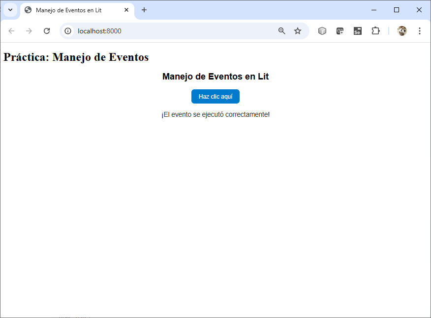
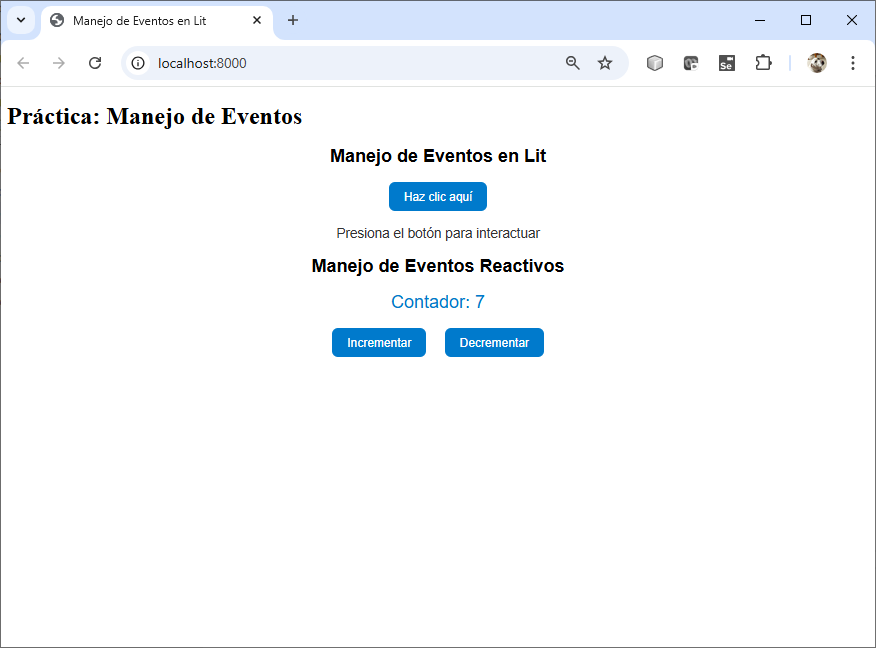
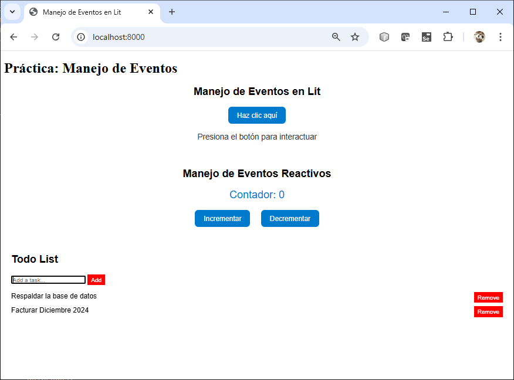
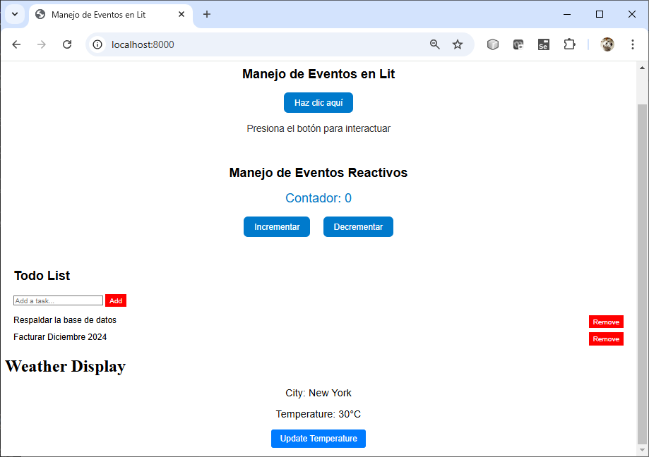

# Práctica 3.2.2 Eventos & Reactividad

## Objetivo de la práctica:
Al finalizar la práctica, serás capaz de:
- Crear un componente interactivo que gestione eventos del usuario.
- Implementar un componente Lit que maneja eventos de forma reactiva, actualizando el estado interno y reflejando los cambios en la interfaz de usuario.
- gestionar el estado reactivo en componentes Lit mediante el uso de propiedades observables.


## Duración aproximada:
- 95 minutos.

 
## Instrucciones 
 
### Tarea 1: Manejo de Eventos en Lit

En esta tarea, aprenderás a manejar eventos en un componente Lit. Comenzarás con la configuración del proyecto y crearás un componente que capture y gestione eventos, modificando su comportamiento en respuesta a las interacciones del usuario.

#### Paso 1. **Crear la carpeta del proyecto:**  
   Ejecuta el siguiente comando para crear una carpeta llamada `practica3_2_2` que contendrá tu proyecto.

   ```cmd
   mkdir practica3_2_2
   ```

#### Paso 2. **Navegar a la carpeta recién creada:**  
   ```cmd
   cd practica3_2_2
   ```

#### Paso 3. **Inicializar un proyecto Node.js:**  
   ```cmd
   npm init -y
   ```

#### Paso 4. **Instalar dependencias necesarias:**  
   Instala `lit` y `es-dev-server` para trabajar con componentes y ejecutar un servidor local.
   ```cmd
   npm install lit
   npm install --save-dev es-dev-server
   ```
#### Paso 5. **Crear una subcarpeta `src`:**  
   ```cmd
   mkdir src
   ```

#### Paso 6. **Crear el archivo `index.html` en la carpeta raíz:**  
   Este será el punto de entrada de tu proyecto.
   ```cmd
   touch index.html
   ```

#### Paso 7. **Crear el archivo del componente en la carpeta `src`:**  
   ```cmd
   cd src
   touch bb-eventos.js
   ```

#### Paso 8. **Abre el archivo `bb-eventos.js` y agrega el siguiente contenido:**

- **Define un contador que incrementa al hacer clic en un botón.**
- **Muestra un mensaje dinámico basado en la interacción del usuario.**

<br/>

```javascript
   import { LitElement, html, css } from 'lit';

class BbEventos extends LitElement {
  static styles = css`
    :host {
      display: block;
      font-family: Arial, sans-serif;
      text-align: center;
      margin: 20px;
    }
    .button {
      padding: 10px 20px;
      font-size: 16px;
      color: white;
      background-color: #007acc;
      border: none;
      border-radius: 8px;
      cursor: pointer;
      transition: background-color 0.3s ease;
    }
    .button:hover {
      background-color: #005fa3;
    }
    .message {
      margin-top: 20px;
      font-size: 18px;
      color: #333;
    }
  `;

  static properties = {
    message: { type: String },
  };

  constructor() {
    super();
    this.message = 'Presiona el botón para interactuar';
  }

  handleClick() {
    this.message = '¡El evento se ejecutó correctamente!';
  }

  render() {
    return html`
      <h2>Manejo de Eventos en Lit</h2>
      <button class="button" @click="${this.handleClick}">Haz clic aquí</button>
      <div class="message">${this.message}</div>
    `;
  }
}

customElements.define('bb-eventos', BbEventos);

```

#### Paso 9. **Actualizar el archivo `index.html`**

- Abre el archivo `index.html` y define la estructura básica para cargar y mostrar el componente `bb-eventos`.

```html
<!DOCTYPE html>
<html lang="en">
<head>
  <meta charset="UTF-8" />
  <meta name="viewport" content="width=device-width, initial-scale=1.0" />
  <title>Manejo de Eventos en Lit</title>
</head>
<body>
  <h1>Práctica: Manejo de Eventos</h1>
  <!-- Componente personalizado -->
  <bb-eventos></bb-eventos>
  <!-- Cargar el módulo de JavaScript -->
  <script type="module" src="./src/bb-eventos.js"></script>
</body>
</html>
```

#### Paso 10. **Iniciar un servidor local para visualizar el proyecto**

- **Configurar el servidor en `package.json`:**  
   Agrega el siguiente script al archivo `package.json` para iniciar un servidor local:  
   ```json
   "scripts": {
     "start": "es-dev-server --app-index index.html --node-resolve --open"
   }
   ```

- **Inicia el servidor local:**  
   Ejecuta el siguiente comando para cargar la aplicación en tu navegador:  
   ```cmd
   npm start
   ```

#### Paso 11. **Verificar el resultado**

   - Abre tu navegador y observa el componente `bb-eventos`.
   - Interactúa con el botón y verifica que el contador se actualice correctamente.
   - Asegúrate de que los eventos se manejen de forma fluida y que el diseño sea coherente. 

<br/><br/>

### Tarea 2. Manejo de Eventos Reactivos

En esta tarea, aprenderás a manejar eventos reactivos en un componente Lit y a integrarlo con el archivo `index.html`.

#### Paso 1. **Implementar el Componente Lit**

1. Crea o abre el archivo `bb-eventos-reactivos.js` y agrega el siguiente código:

   ```javascript
   import { LitElement, html, css } from 'lit';

   class BbEventosReactivos extends LitElement {
     static styles = css`
       :host {
         display: block;
         font-family: Arial, sans-serif;
         text-align: center;
         margin: 20px;
       }
       .counter {
         font-size: 24px;
         margin: 20px 0;
         color: #007acc;
       }
       .button {
         padding: 10px 20px;
         font-size: 16px;
         color: white;
         background-color: #007acc;
         border: none;
         border-radius: 8px;
         cursor: pointer;
         margin: 0 10px;
         transition: background-color 0.3s ease;
       }
       .button:hover {
         background-color: #005fa3;
       }
     `;

     static properties = {
       count: { type: Number },
     };

     constructor() {
       super();
       this.count = 0; // Valor inicial del contador
     }

     increment() {
       this.count += 1;
     }

     decrement() {
       this.count -= 1;
     }

     render() {
       return html`
         <h2>Manejo de Eventos Reactivos</h2>
         <p class="counter">Contador: ${this.count}</p>
         <button class="button" @click="${this.increment}">Incrementar</button>
         <button class="button" @click="${this.decrement}">Decrementar</button>
       `;
     }
   }

   customElements.define('bb-eventos-reactivos', BbEventosReactivos);
   ```


#### Paso 2. **Modificar el archivo `index.html`**
1. Abre el archivo `index.html` y agrega el siguiente código para integrar el componente `bb-eventos-reactivos`:

   ```html
  
     <!-- Componente personalizado -->
     <bb-eventos-reactivos></bb-eventos-reactivos>

     <!-- Cargar el módulo de JavaScript -->
     <script type="module" src="./src/bb-eventos-reactivos.js"></script>
   
   ```


#### Paso 3. **Verificar el resultado**

   - Abre tu navegador y recarga la página.
   - Interactúa con los botones para incrementar y decrementar el contador.

<br/><br/>

### Tarea 3: Gestión de Estado Reactivo con Propiedades Observables

#### Paso 1. **Implementar el Componente Lit**

```javascript
import { LitElement, html, css } from 'lit';
import { property } from 'lit/decorators.js';

export class BBTodoList extends LitElement {
  static styles = css`
    :host {
      display: block;
      font-family: Arial, sans-serif;
      margin: 1rem;
    }
    ul {
      list-style: none;
      padding: 0;
    }
    li {
      margin: 0.5rem 0;
      display: flex;
      justify-content: space-between;
    }
    button {
      background-color: red;
      color: white;
      border: none;
      padding: 0.3rem 0.5rem;
      cursor: pointer;
    }
    button:hover {
      background-color: darkred;
    }
  `;

  // Definición de propiedades reactivas en un getter estático
  static get properties() {
    return {
      tasks: { type: Array },
  
    };
  }

  constructor() {
    super();
    this.tasks = ['Respaldar la base de datos', 'Facturar Diciembre 2024'];
 
  }

  // Método para agregar una nueva tarea
  addTask(task) {
    this.tasks = [...this.tasks, task];
  }

  // Método para eliminar una tarea
  removeTask(index) {
    this.tasks = this.tasks.filter((_, i) => i !== index);
  }

  // Renderizado del componente
  render() {
    console.log("render()");
    return html`
      <h2>Todo List</h2>
      <input id="taskInput" type="text" placeholder="Add a task..." />
      <button @click="${this.handleAddTask}">Add</button>
      <ul>
        ${this.tasks.map(
          (task, index) => html`
            <li>
              ${task}
              <button @click="${() => this.removeTask(index)}">Remove</button>
            </li>
          `
        )}
      </ul>
    `;
  }

  handleAddTask() {
    const input = this.shadowRoot.getElementById('taskInput');
    const task = input.value.trim();
    if (task) {
      this.addTask(task);
      input.value = '';
    }
  }
}

customElements.define('bb-todo-list', BBTodoList);

```

#### Paso 2. **Modificar el archivo `index.html`**

```html
    <!-- Componente personalizado -->
    <bb-todo-list></bb-todo-list>
    <!-- Cargar el módulo de JavaScript -->
    <script type="module" src="src/bb-todoList.js"></script>
```


#### Paso 3. **Verificar el resultado**

- Abre tu navegador y recarga la página para asegurarte de que los cambios se reflejan correctamente.
- Prueba el componente implementado en esta práctica interactuando con sus funcionalidades para validar su comportamiento esperado.

<br/><br/>


### Tarea 4. Actualizaciones eficientes del DOM con requestUpdate.

#### Paso 1. **Implementar el componente Lit**

- Crea un nuevo archivo llamado `bb-weather-display.js` en la carpeta de componentes y añade el siguiente código:

- El componente muestra una ciudad y su temperatura. Incluye un botón para actualizar manualmente la temperatura de manera eficiente utilizando `requestUpdate`.

```javascript
 import { LitElement, html, css } from 'lit';

export class BBWeatherDisplay extends LitElement {
  static styles = css`
    :host {
      display: block;
      font-family: Arial, sans-serif;
      text-align: center;
      margin: 1rem;
    }
    .weather-info {
      font-size: 1.2rem;
      margin-bottom: 1rem;
    }
    button {
      padding: 0.5rem 1rem;
      font-size: 1rem;
      background-color: #007bff;
      color: white;
      border: none;
      border-radius: 4px;
      cursor: pointer;
    }
    button:hover {
      background-color: #0056b3;
    }
  `;

  constructor() {
    super();
    this.city = 'New York';
    this.temperature = 25; // Temperatura inicial
  }

  // Simula la actualización de la temperatura
  updateTemperature() {
    this.temperature = Math.floor(Math.random() * 35); // Genera una nueva temperatura aleatoria
    this.requestUpdate(); // Fuerza la actualización del DOM de manera eficiente
  }

  render() {
    console.log("render()");
    return html`
      <div class="weather-info">
        <p>City: ${this.city}</p>
        <p>Temperature: ${this.temperature}°C</p>
      </div>
      <button @click="${this.updateTemperature}">Update Temperature</button>
    `;
  }
}

customElements.define('bb-weather-display', BBWeatherDisplay);

```

#### Paso 2. **Modificar el archivo `index.html`**

1. Abre el archivo `index.html` en la raíz del proyecto.
2. Importa el componente `weather-display.js` y añádelo al cuerpo del documento.

Ejemplo de `index.html`:

```html
    <script type="module" src="src/bb-weatherDisplay.js"></script>
    <h1>Weather Display</h1>
    <bb-weather-display></weather-display>
```


#### Paso 3. **Verificar el resultado**

1. Recarga el proyecto de esta práctica.
2. Interactúa con el componente haciendo clic en el botón **Update Temperature**. 
3. Verifica que la temperatura se actualiza de manera eficiente sin afectar otros elementos de la página.


**Nota**: 
- Esta práctica ayuda a comprender cómo usar `requestUpdate` para optimizar actualizaciones del DOM, especialmente en casos donde los cambios en el estado no se gestionan automáticamente por propiedades reactivas.

<br/><br/>

### Resultado esperado

- Captura de pantalla para mostrar la salida de la Tarea 1.



<br/>

- Captura de pantalla para mostrar la salida de la Tarea 2.



<br/>

- Captura de pantalla para mostrar la salida de la Tarea 3.



<br/>

- Captura de pantalla para mostrar la salida de la Tarea 4.

