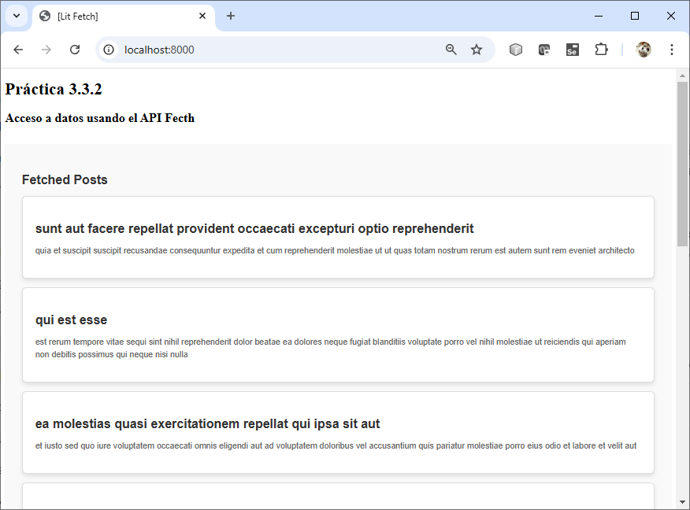

# Práctica 3.3.2. Consumiendo APIs REST con Fetch y Renderizado Dinámico en Lit

## Objetivo de la práctica:
Al finalizar la práctica, serás capaz de:
- Consumir datos de una API REST utilizando la Fetch API en un componente de Lit, y renderizar dinámicamente estos datos en el DOM de manera eficiente.
 
## Duración aproximada:
- 95 minutos.

## Instrucciones 
 
### Tarea 1. **Creación del Proyecto con Lit**

#### Paso 1. **Abre tu terminal y crea un directorio para el proyecto**
   ```cmd
   mkdir practica3_3_2
   cd practica3_3_2
   ```
#### Paso 2. **Inicializa un proyecto con Node.js**
   ```cmd
   npm init -y
   ```

#### Paso 3. **Instala Lit**
   ```cmd
   npm install lit
   ```

#### Paso 4. **Crea una estructura básica de archivos**
   ```bash
   mkdir src
   touch index.html src/bb-component.js
   ```

###  ** Tarea 2. Configuración del Archivo HTML**

#### Paso 1. **En el archivo `src/index.html`, escribe el siguiente código:**

   ```html
    <!DOCTYPE html>
    <html lang="en">
    <head>
        <meta charset="UTF-8">
        <meta name="viewport" content="width=device-width, initial-scale=1.0">
        <title>[Lit Fetch]</title>
        <script type="module" src="./src/bb-component.js"></script>
    </head>
    <body>
        <h1>Práctica 3.3.2</h1>
        <h2>Acceso a datos usando el API Fecth</h2>
        <br/>
        <bb-component></bb-component>
    </body>
    </html>
   ```

### **Tarea 3. Creación del Componente en Lit**

#### Paso 1. **En el archivo `src/my-component.js`, escribe el siguiente código inicial:**

```javascript
import { LitElement, html, css } from 'lit';

export class BBComponent extends LitElement {
    static properties = {
        data: { type: Array }, // Propiedad reactiva para almacenar los datos
    };

        static styles = css`
        :host {
        display: block;
        font-family: 'Arial', sans-serif;
        background: #f9f9f9;
        padding: 2rem;
        }
    
        .card {
        border: 1px solid #ddd;
        background-color: #fff;
        padding: 1.5rem;
        margin: 1rem 0;
        border-radius: 8px;
        box-shadow: 0 4px 8px rgba(0, 0, 0, 0.1);
        transition: transform 0.2s, box-shadow 0.2s;
        }
    
        .card:hover {
        transform: translateY(-5px);
        box-shadow: 0 6px 15px rgba(0, 0, 0, 0.2);
        }
    
        h3 {
        font-size: 1.5rem;
        color: #333;
        margin-bottom: 0.5rem;
        }
    
        p {
        font-size: 1rem;
        color: #666;
        line-height: 1.5;
        }
    
        h2 {
        text-align: center;
        color: #007BFF;
        margin-bottom: 2rem;
        }
    
        .container {
        max-width: 800px;
        margin: 0 auto;
        }
    `;
  
    constructor() {
        super();
        this.data = [];
    }

    connectedCallback() {
        console.log("connectedCallback");
        super.connectedCallback();
        this.fetchData();
    }

    async fetchData() {
        console.log("fetchData()");
        try {
            const response = await fetch('https://jsonplaceholder.typicode.com/posts');
            const result = await response.json();
            this.data = result.slice(0, 10); // Limitar a los primeros 10 resultados
            console.log(this.data);
        } catch (error) {
            console.error('Error fetching data:', error);
        }
    }

    render() {
        console.log("render()");
        return html`
            <div>
                <h3>Fetched Posts</h3>
                ${this.data.length === 0 ? html`<p>Loading...</p>`
                : html`
                        ${this.data.map((item) => html`
                                <div class="card">
                                    <h3>${item.title}</h3>
                                    <p>${item.body}</p>
                                </div>
                            `
                )}
                    `}
            </div>
        `;
    }
}

console.log("customElements.define()");
customElements.define('bb-component', BBComponent);
```

### **Tarea 4. Ejecución del Proyecto**

#### Paso 1. **Instala un servidor de desarrollo local:**
   ```cmd
   npm install --save-dev lite-server
   ```

#### Paso 2. Agrega un script para ejecutar el servidor en el archivo `package.json`:
   ```json
   "scripts": {
     "start": "es-dev-server --app-index index.html --node-resolve --open"
   }
   ```

#### Paso 3. Ejecuta el proyecto:
   ```cmd
   npm start
   ```


#### Paso 4. **Actividades Adicionales**
- Cambia la API a otra fuente de datos como `https://jsonplaceholder.typicode.com/users` y adapta la estructura para mostrar nombres, correos y direcciones.
- Agrega un campo de entrada para filtrar dinámicamente los resultados (por ejemplo, por título).


**Nota**: 
- Con esta práctica, los participantes podrán interactuar con APIs REST, entender el flujo asíncrono y cómo Lit optimiza el renderizado basado en datos reactivos.
 

### Resultado esperado

Captura de pantalla con la salida de los datos en el navegador.


